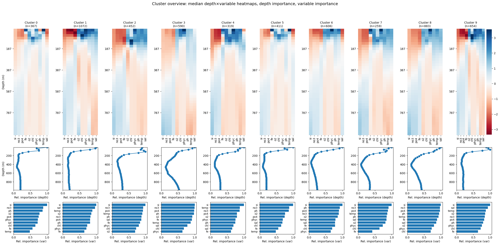
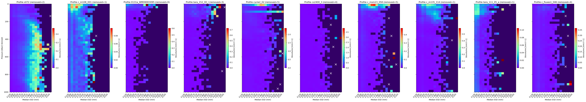
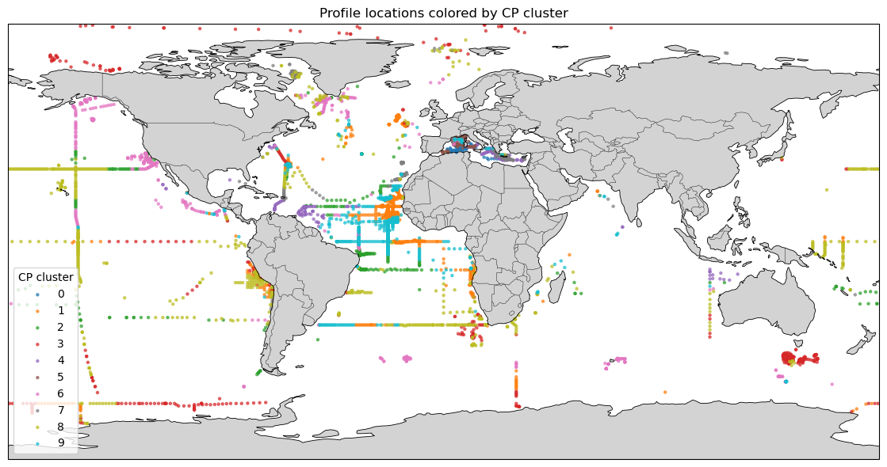

# Dataset Characteristics

**[Notebook](exploratory_data_analysis.ipynb)**

## Dataset Information

### Dataset Source
- **Dataset Link:** [PANGEA dataset](https://doi.pangaea.de/10.1594/PANGAEA.924375), [Related paper](https://essd.copernicus.org/articles/14/4315/2022/), data from 2022-2025 not published
- **Dataset Owner/Contact:** Rainer Kiko, [ORCid](https://orcid.org/0000-0002-7851-9107)

### Dataset Characteristics
- **Number of Observations:** 5613 vertical profiles of particle biovolume, aggregated to 40 depth bins of 25 m (0-1000 m), particle biovolumes estimated for 17 size classes (~ 0.2 - 10 mm)
- **Number of Features:** 5613 x 40 x 17 = 3,816,840

### Target Variable/Label
- **Label Name:** cluster
- **Label Type:** Classification
- **Label Description:** Clusters are based on prior classification of profiles by vertical patterns of environmental variables (e.g., temperature, salinity, nutrients,...; 10 variables in total), see [Notebook](DatasetPreProcessing/2_Environmental_clusters.ipynb). Prediction task: predict the envrionmental cluster based on particle biovolume distribution.
- **Label Values:** 0-9 (10 clusters, each representing specific envrionmental conditions within the upper 1000 m of the ocean)
- **Label Distribution:** [Brief description of class balance for classification or value distribution for regression]

### Feature Description
[Provide a brief description of each feature or group of features in your dataset. If you have many features, group them logically and describe each group. Include information about data types, ranges, and what each feature represents.]

- Features are particle biovolumes (original unit: mm^3 L^-1), z-score normalized per profile.
- Each profile has a biovolume value (feature) for each of 40 depths and 17 size classes, resulting in 680 features (or pixels).
- Size classes are spaced logarithmically, with increasing ranges (i.e., smallest used size class: 0.203-0.256 mm; largest used size class: 8.19-10.3 mm).
- Depths are measured in dbar (1 dbar = 1 m). In the first ~ 200-300 m of the ocean light still penetrates the water and phytoplankton grows, resulting in common peaks of particle biovolume in this layer. Below, most of the produced organic matter is consumed by zooplankton and microbes, resulting in a steep decline in particle biovolume with depth.

## Exploratory Data Analysis

The exploratory data analysis is conducted in the [exploratory_data_analysis.ipynb](exploratory_data_analysis.ipynb) notebook, which includes:

- Data loading and initial inspection
- Statistical summaries and distributions
- Missing value analysis
- Feature correlation analysis
- Data visualization and insights
- Data quality assessment
