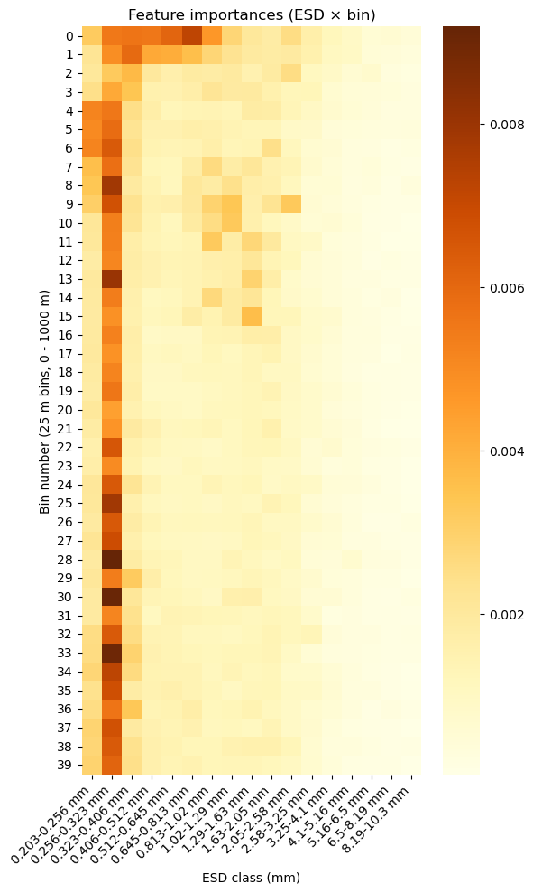
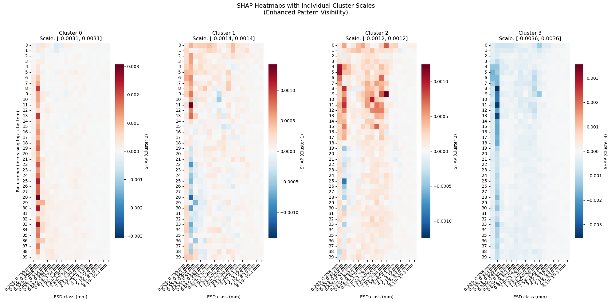

# Baseline Model

**[Notebook](baseline_model.ipynb)**

## Baseline Model Results

### Model Selection
- **Baseline Model Type:** Random Forest
- **Rationale:** Random Forest allows to compute feature importance values which allow us to reduce the number of features for later models. Additionally, Random Forest is well suited as a baseline for this dataset because it handles high-dimensional, non-linear features effectively and requires minimal preprocessing of the biovolume bins. It is robust to noise, correlations, and class imbalance, and it provides interpretable feature importances. This makes it a strong, reliable reference model before exploring more complex approaches.

### Model Performance
- **Evaluation Metric:** Accuracy, Balanced Accuraccy, Macro F1
- **Performance Scores:** 

|**Metric** |**Training set** | **Test set**| **Cross-Validation Score**|
|---|---|---|---|
|Accuracy| 0.99 | 0.55|  mean=0.5000, std=0.0195|
|Balanced Accuracy| 0.99| 0.54| mean=0.5005, std=0.0205|
|Macro F1| 0.99| 0.53| mean=0.4914, std=0.0197|

### Confusion Matrix

### Global feature importance map

### Evaluation Methodology
- **Data Split:** 
Test = ~25 %; Train = 75%, split train data into 4 folds, each ~18% of all data. After cross-validation, a final model war trained on all trianing data.

- see [notebook](train-test-val-split.ipynb) for methods on ensuring equal geographical and cluster-distribiton

- **Evaluation Metrics:** To assess the baseline model’s performance and establish reference values for more complex models later on, following metrics are used:

    - **Accuracy**: Measures the overall proportion of correct predictions. Useful for a general performance overview, but limited when class imbalance is present. 

    - **Balanced Accuracy**: Computes the average accuracy across all classes, giving equal weight to minority and majority classes. This metric is essential because the cluster distribution is imbalanced.

    - **Macro F1 Score**: Averages the F1-score across all classes without weighting by class frequency. This provides a balanced view of precision and recall for each cluster, including minority groups.

- *More detailed evaluation and interpretation*:
    - **Confusion Matrix**: Visualizes how often each cluster is correctly and incorrectly classified. Helps detect systematic misclassification patterns between clusters.

    - **Classification Report**: Summarizes precision, recall, and F1-score for each class individually. Supports detailed assessment of classes that are harder to separate.

    - **SHAP (SHapley Additive exPlanations)**: Provides model-agnostic feature-attribution scores that show how much each feature contributes to a prediction. SHAP was used to: interpret global feature importance and analyze feature effects for each cluster. For later CNN models, this can be replaced by GRAD-CAM or other methods which visualize feature importance as heatmaps.

### Metric Practical Relevance
- Practical goal: ensure the model not only achieves reasonable overall correctness but also performs acceptably on minority classes (rarer environmental clusters).
- Interpretation of results:
    - High training accuracy/balanced accuracy/macro F1 (0.99) and low cross-validation and test scores suggests high overfitting, affecting all classes.
    - Accuracy was slightly higher in cross-validation (0.38) compared to balanced accuracy and Macro F1 (0.34), indicating influence of larger clusters. Focus should be on balanced metrics for further models.
- Actions: 
    - augmentation with noise to reduce overfitting
    - include hierarchal structure of clusters in future models (some environmental clusters are more similar than others)
        - potentially pool clusters which are small and similar in environmental conditions
    - compare confusion matrix and environmental cluster hierarchy - are clusters which are more similar in environmental conditions confused more often?
    - reduce features: remove three largest size bins for all depths because they have 0 feature importance across all classes (reduces overall feature number from 680 to 560)
- Conclusion:
    - RF is not suitable for the proposed problem, liekly because it does not include 2D relationships between neighboring size x depth-bins. Convolutional neural nets may result in better predictions.

## Next Steps
- This baseline model serves as a reference point for evaluating more sophisticated models in the [Model Definition and Evaluation](../3_Model/README.md) phase. 
- SHAP analyses of feature importance revealed that the three largest size classes did not add any information for the classification model. These features will therefore be removed for proceeding analyses.
