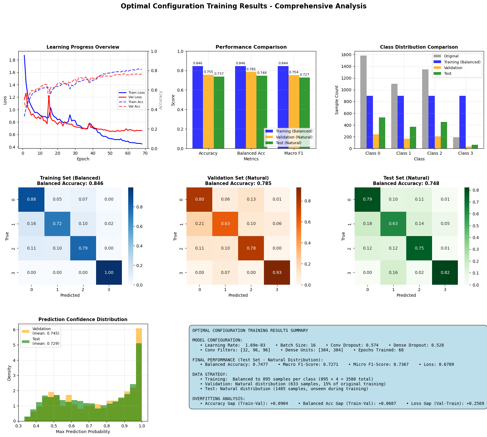

# Model Definition and Evaluation

**[Notebook](model_definition_evaluation)**

# Model comparison:

|**Metric**       |**Training set** | **Test set** | **Cross-Validation Score**|
|---|---|---|---|
| **Baseline model: RF** |          |              |                           |
|Balanced Accuracy| 0.99            | 0.54         | 0.5005 ± 0.0205           |
|Macro F1         | 0.99            | 0.53         | 0.4914 ± 0.0197           |
| **First CNN: small heatmaps** |   |              |                           |
|Balanced Accuracy| 0.8175 ± 0.0420 |              | 0.5901 ± 0.0157           |
|Macro F1         | 0.8159 ± 0.0431 |              | 0.5849 ± 0.0189           |
|*First CNN: small heatmaps, turbo cmap, bicubic smoothing* | | |              |
|Balanced Accuracy| 0.8187 ± 0.0584 |              | 0.5856 ± 0.0104           |         
|Macro F1         | 0.8152 ± 0.0609 |              | 0.5762 ± 0.0175           |
|**Second CNN: hierarchical model** |  |           |                           |
| *Finest: 10 clusters* | | | |
|Balanced Accuracy      | 0.6889 ± 0.0155 |               | 0.5296 ± 0.0122    |         
|Hier. BA (very similar)| 0.8950 ± 0.0080 |               | 0.7976 ± 0.0075    |
|Hier. BA (mod. similar)| 0.9554 ± 0.0038 |               | 0.8961 ± 0.0063    |
|Hier. BA (different)   | 0.9813 ± 0.0018 |               | 0.9427 ± 0.0078    |
| *Medium: 6 clusters* | | | |
|Balanced Accuracy      | 0.8108 ± 0.0227 |               | 0.6485 ± 0.0130    |         
|Hier. BA (very similar)| 0.9566 ± 0.0050 |               | 0.9051 ± 0.0022    |
|Hier. BA (mod. similar)| 0.9966 ± 0.0015 |               | 0.9842 ± 0.0062    |
|Hier. BA (different)   | 0.9966 ± 0.0015 |               | 0.9842 ± 0.0062    |
| *Coarse: 4 clusters* | | | |
|Balanced Accuracy      | 0.8577 ± 0.0168 |               | 0.6809 ± 0.0191    |         
|Hier. BA (very similar)| 0.9958 ± 0.0017 |               | 0.9769 ± 0.0051    |
|Hier. BA (mod. similar)| 0.9993 ± 0.0005 |               | 0.9936 ± 0.0042    |
|Hier. BA (different)   | 0.9993 ± 0.0005 |               | 0.9936 ± 0.0042    |
| *Coarsest: 2 clusters* | | | |
|Balanced Accuracy      | 0.9028 ± 0.0053 |               | 0.8002 ± 0.0182    |         
|Hier. BA (very similar)| 1.0000 ± 0.0000 |               | 1.0000 ± 0.0000    |
|Hier. BA (mod. similar)| 1.0000 ± 0.0000 |               | 1.0000 ± 0.0000    |
|Hier. BA (different)   | 1.0000 ± 0.0000 |               | 1.0000 ± 0.0000    |

# First CNN: small heatmaps
- **Hyperparameters:**
    - learning_rate = 0.001
    - dropout_rate_conv = 0.25
    - dropout_rate_dense = 0.5
    - batch_size = 32
    - epochs = 100
    - patience = 10 # patience of early stopping callback
    - verbose_val = 2 # no output during training
    - k = 4 # number of folds for cross-validation
    - metrics_to_monitor = ['accuracy']
    - noise_level = 0.05 # Gaussian noise level - data augmentation
    - block_size = 3 # Block size for block-wise noise
- Data input shape: 45 x 45 x 4 (pixel shape, channels)
- small heatmaps where 3 pixels along the x-axis = 1 datapoint, including padding to get a square
- simple over/undersampling to mean per class for each fold
- **Comparison to baseline:** CV metics ~ 8-9% better, less overfitting (training scores at 82% not 99)

# Second CNN: hierarchical model
- The standard CNN was transformed into a multi-level hierarchical model
- Simultaniously predicts envrionmental clusters at four different scales: 
    - level 1: 2 groups (coarsest)
    - level 2: 4 groups
    - level 3: 6 groups
    - level 4: 10 groups (original clusters, finest)
- Method: 
    - Multi-head model: each level "head" has one dedicated dense layer (more nodes with higher complexity) and a dedicated output layer
    - Multi-level loss weighting: mistakes between environmentally similar clusters are penalized less than mistakes between distant clusters
    - Calculates hierarchical accuracy (if distance between true and predicted class is below a threshold, counted as correct):
        - very_similar: 25th percentile of distances
        - moderately_similar: 50th percentile of distances
        - different: 75th percentile of distances

#### Hierarchy of clusters

**Hierarchical accuracy thresholds**

