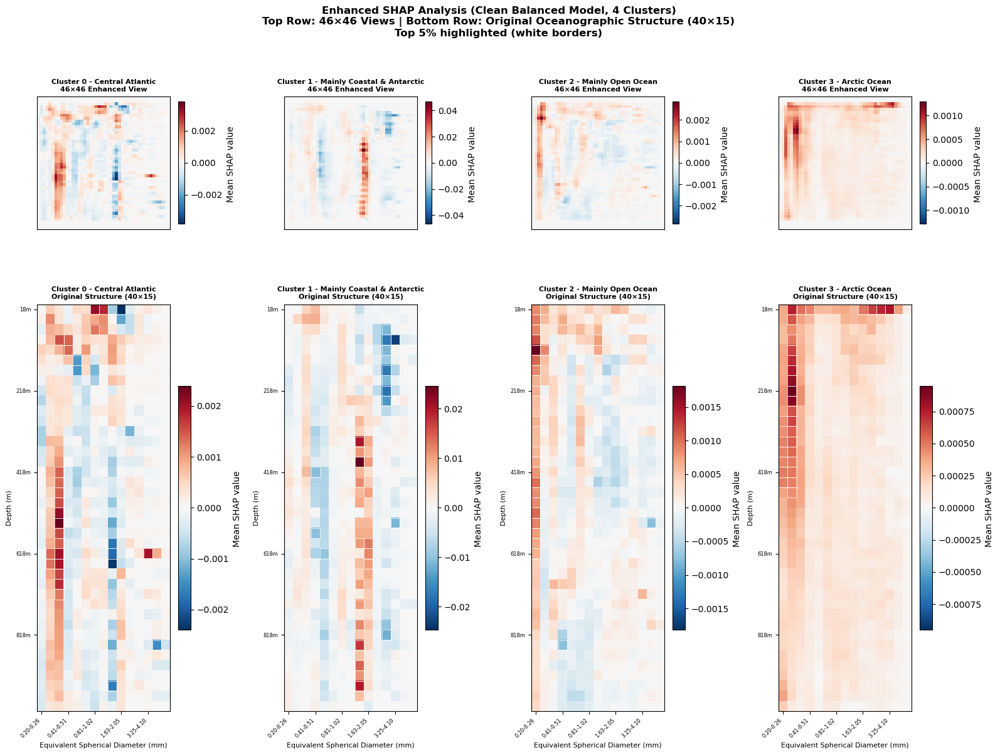

# Model Definition and Evaluation

**[Notebook](model_definition_evaluation)**

# Model comparison:

|**Metric**                     |**Training set** | **Test set** | **Cross-Validation Score**|
|---|---|---|---|
| **Baseline model:**           |                 |              |                           |
|Balanced Accuracy              | 0.99            | 0.74         | 0.73 ± 0.03               |
| **First CNN** |                 |              |                           |
|Balanced Accuracy              |     0.86 ± 0.02 |     -        | 0.67 ± 0.03               |
| **Second CNN: tuning with optuna** |            |              |                           |
|Balanced Accuracy              | 0.85            | 0.75         | 0.79 (10 % validation set)|
| **Transfer learning model - ResNet50**| | | |
| | | | |

# First CNN
- **Hyperparameters:**
    - learning_rate = 0.001
    - dropout_rate_conv = 0.25
    - dropout_rate_dense = 0.5
    - batch_size = 32
    - epochs = 100
    - patience = 10 (patience of early stopping callback)
    - k = 4 (number of folds for cross-validation)
    - metrics_to_monitor = ['accuracy']
    - noise_level = 0.05 (Gaussian noise level - data augmentation)
    - block_size = 3 (Block size for block-wise noise)
- Data input shape: 45 x 45 x 4 (pixel shape, channels)
- small heatmaps where 3 pixels along the x-axis = 1 datapoint, including padding to get a square
- simple over/undersampling to mean per class for each fold
- **Comparison to baseline:** less overfitting (training scores at 86% not 99)

# Second CNN: tuning with optuna to improve balanced accuracy and reduce overfitting
- optimized hyperparameters with one of four validation folds
- trained final model with 15% validation data and tested on separate test set
- **Hyperparameters:**
    learning_rate            :  0.0017
    batch_size               :  16
    dropout_rate_conv        :  0.574
    dropout_rate_dense       :  0.528
    conv_filters_1           :  32
    conv_filters_2           :  96
    conv_filters_3           :  96
    dense_units_1            :  384
    dense_units_2            :  384
    noise_level              :  0.034
    block_size               :  3
    lr_reduction_factor      :  0.364
    lr_patience              :  6
    early_stop_patience      :  15

# SHAP analysis of features per cluster for second CNN
- SHAP values were calculated for all features and averaged per cluster
- square image-shapes were agrgegated into original data shape (40 depths x 15 size classes, bottom row)
- High positive (red) SHAP values indicate that the feature value increases the probability of the target class.

