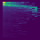
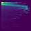
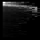
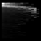
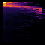
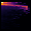
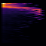
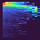
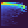

# Model Definition and Evaluation

**[Notebook](model_definition_evaluation)**

# Model comparison:

|**Metric**       |**Training set** | **Test set** | **Cross-Validation Score**|
|---|---|---|---|
| **Baseline model: RF** |          |              |                           |
|Balanced Accuracy| 0.99            | 0.54         | mean=0.5005, std=0.0205   |
|Macro F1         | 0.99            | 0.53         | mean=0.4914, std=0.0197   |
| **First CNN: small heatmaps** |   |              |                           |
|Balanced Accuracy| 0.8175 ± 0.0420 |              | mean=0.5901, std=0.0157   |
|Macro F1         | 0.8159 ± 0.0431 |              | mean=0.5849, std=0.0189   |

# First CNN: small heatmaps
- **Hyperparameters:**
    - learning_rate = 0.001
    - dropout_rate_conv = 0.25
    - dropout_rate_dense = 0.5
    - batch_size = 32
    - epochs = 100
    - patience = 10 # patience of early stopping callback
    - verbose_val = 2 # no output during training
    - k = 4 # number of folds for cross-validation
    - metrics_to_monitor = ['accuracy']
    - noise_level = 0.05 # Gaussian noise level - data augmentation
    - block_size = 3 # Block size for block-wise noise
- Data input shape: 45 x 45 x 4 (pixel shape, channels)
- small heatmaps where 3 pixels along the x-axis = 1 datapoint, including padding to get a square
- simple over/undersampling to mean per class for each fold
- **Comparison to baseline:** CV metics ~ 8-9% better, less overfitting (training scores at 82% not 99)

samples:

## Heatmap 00

============================================================
OVERALL CV SUMMARY
============================================================
Heatmap Dir: ../Data/heatmaps_00
Heatmap Params:

--- Content of __params_for_heatmaps_00.txt ---

size: 45^2 px
crop: 0px
color theme: None
interpolation: None
gamma: 1
gaussion strength: 0.1

============================================================
Mean Balanced Accuracy: 0.579 ± 0.010
Mean Macro F1: 0.574 ± 0.012

Pipeline completed successfully!

============================================================
OVERALL CV SUMMARY
============================================================
Heatmap Dir: ../Data/heatmaps_01
Heatmap Params:

--- Content of __params_for_heatmaps_01.txt ---

size: 48^2 px
crop: 1px
color theme: None
interpolation: None
gamma: 1
gaussion strength: 0.1

============================================================
Mean Balanced Accuracy: 0.582 ± 0.010
Mean Macro F1: 0.579 ± 0.008

Pipeline completed successfully!

============================================================
OVERALL CV SUMMARY
============================================================

Heatmap Dir: ../Data/heatmaps_02
Heatmap Params:

--- Content of __params_for_heatmaps_02.txt ---

size: 48^2 px
crop: 1px
color theme: None
interpolation: bilinear
gamma: 1
gaussion strength: 0.1

============================================================
Mean Balanced Accuracy: 0.591 ± 0.017
Mean Macro F1: 0.584 ± 0.020

Pipeline completed successfully!

============================================================
OVERALL CV SUMMARY
============================================================
Heatmap Dir: ../Data/heatmaps_03
Heatmap Params:

--- Content of __params_for_heatmaps_03.txt ---

size: 48^2 px
crop: 1px
color theme: None
interpolation: bicubic
gamma: 1
gaussion strength: 0.1

============================================================
Mean Balanced Accuracy: 0.586 ± 0.028
Mean Macro F1: 0.583 ± 0.028

Pipeline completed successfully!

============================================================
OVERALL CV SUMMARY
============================================================
Heatmap Dir: ../Data/heatmaps_04
Heatmap Params: Keine Parameter-Datei gefunden.
============================================================
Mean Balanced Accuracy: 0.607 ± 0.010
Mean Macro F1: 0.604 ± 0.009

Pipeline completed successfully!

============================================================
OVERALL CV SUMMARY
============================================================
Heatmap Dir: ../Data/heatmaps_10
Heatmap Params:

--- Content of __params_for_heatmaps_10.txt ---

size: 45^2 px
crop: 0px
color theme: gray
interpolation: None
gamma: 1
gaussion strength: 0.1

============================================================
Mean Balanced Accuracy: 0.566 ± 0.018
Mean Macro F1: 0.560 ± 0.015

Pipeline completed successfully!

============================================================
OVERALL CV SUMMARY
============================================================
Heatmap Dir: ../Data/heatmaps_20
Heatmap Params:

--- Content of __params_for_heatmaps_20.txt ---

size: 45^2 px
crop: 0px
color theme: inferno
interpolation: None
gamma: 1
gaussion strength: 0.1

============================================================
Mean Balanced Accuracy: 0.586 ± 0.028
Mean Macro F1: 0.581 ± 0.029

Pipeline completed successfully!

============================================================
OVERALL CV SUMMARY
============================================================
Heatmap Dir: ../Data/heatmaps_30
Heatmap Params:

--- Content of __params_for_heatmaps_30.txt ---

size: 45^2 px
crop: 0px
color theme: turbo
interpolation: None
gamma: 1
gaussion strength: 0.1

============================================================
Mean Balanced Accuracy: 0.583 ± 0.018
Mean Macro F1: 0.575 ± 0.015

Pipeline completed successfully!

============================================================
OVERALL CV SUMMARY
============================================================
Heatmap Dir: ../Data/heatmaps_34
Heatmap Params:

--- Content of __params_for_heatmaps_34.txt ---

size: 48^2 px
crop: 1px
color theme: turbo
interpolation: bilinear
gamma: 1
gaussion strength: 0.1

============================================================
Mean Balanced Accuracy: 0.582 ± 0.023
Mean Macro F1: 0.579 ± 0.024

Pipeline completed successfully!

============================================================
OVERALL CV SUMMARY
============================================================
Heatmap Dir: ../Data/heatmaps_35
Heatmap Params:

--- Content of __params_for_heatmaps_35.txt ---

size: 48^2 px
crop: 1px
color theme: turbo
interpolation: bicubic
gamma: 1
gaussion strength: 0.1

============================================================
Mean Balanced Accuracy: 0.589 ± 0.023
Mean Macro F1: 0.587 ± 0.019

Pipeline completed successfully!

============================================================
OVERALL CV SUMMARY
============================================================
Heatmap Dir: ../Data/heatmaps_bilinear_144px
Heatmap Params: Keine Parameter-Datei gefunden.

============================================================
Mean Balanced Accuracy: 0.593 ± 0.010
Mean Macro F1: 0.588 ± 0.011

Pipeline completed successfully!

============================================================
OVERALL CV SUMMARY
============================================================
Heatmap Dir: ../Data/heatmaps_nearest_45px
Heatmap Params: Keine Parameter-Datei gefunden.

============================================================
Mean Balanced Accuracy: 0.577 ± 0.011
Mean Macro F1: 0.572 ± 0.007

Pipeline completed successfully!

============================================================
OVERALL CV SUMMARY
============================================================
Heatmap Dir: ../Data/heatmaps_nearest_48px_bw
Heatmap Params: Keine Parameter-Datei gefunden.

============================================================
Mean Balanced Accuracy: 0.589 ± 0.015
Mean Macro F1: 0.583 ± 0.019

Pipeline completed successfully!

<!-- ============================================================
OVERALL CV SUMMARY
============================================================
Heatmap Dir: ../Data/heatmaps_samples
Heatmap Params:

--- Content of __params_for_heatmaps_samples.txt ---

size: 45^2 px
crop: 0px
color theme: None
interpolation: None
gamma: 1
gaussion strength: 0.1

============================================================
Mean Balanced Accuracy: 0.603 ± 0.024
Mean Macro F1: 0.600 ± 0.023

Pipeline completed successfully! -->