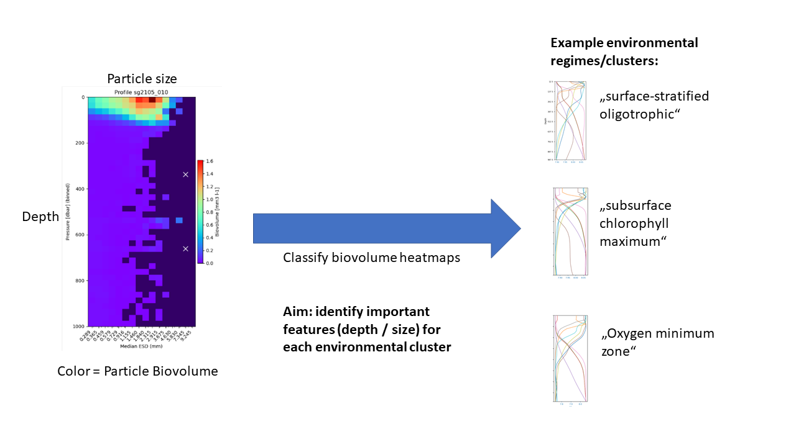

# Carbon Flux Prediction

## Repository Link

[https://github.com/bthobor/carbon-flux-prediction](https://github.com/SchnitzelKingKong/carbon-flux-prediction)

## Description

Here we create an ML model to classify vertical oceanographic profiles of particle size-distributions into classes representing environmental regimes.
The aim is to answer the research question: *What particle biovolume features (depths- and size-bins) are predictive of different environmental conditions (clusters)?*
Our main approach is to visualize particle biovolume features as heatmaps and use convolutional neural networks, followed by explainable AI tools (e.g., SHAP) to better understand particle distribution patterns under different environmental conditions.

### Task Type

Image classification

### Results Summary

#### Best Model Performance
- **Best Model:** CNN, hyperparameters optimized with optuna
- **Evaluation Metric:** Balanced Accuracy
- **Final Performance:** 75% balanced accuracy

#### Model Comparison
- **Baseline Performance:** Balanced accuracy (test) of radom forest model = 74%
- **Improvement Over Baseline:** 1 % improvement of balanced accuracy, but less overfitting (86% training accuracy vs. 99% for baseline) and more 2D structures captured (as seen in SHAP plots)

#### Key Insights
- **Most Important Features:** Different features were important for different clusters, indicating that each environmental cluster was characterized by specific patterns in particle size & depth
- **Model Strengths:** Classification of cluster 3 (mostly Arctic profiles) with 82% accuracy
- **Model Limitations:** clusters 0-2 were confused more oftern, with lowest accuracy for cluster 1 (63% accuracy). However, this pattern may also reflect environmental gradients as clusters 0-2 were also environmentally more similar.
- **Business Impact:** 
- By using explainable AI tools to relate feature importance for specific clusters back to environmental regimes, we can identify patterns in particle distirbution across size classes and depths. 

- Organic particles which sink below ~ 1000 m depth store carbon in the ocean, ultimately removing CO2 from the atmosphere and counter-acts human CO2 emmissions. Therefore, we want to find out how particle flux to depth is affected by environmental change.

- Our preliminary SHAP results suggest that clusters 0 (Central Atlantic), 2  (mainly open ocean) and 3 (Arctic Ocean) were mainly characterized by smaller particles sinking to depth, while cluster 2 (mainly coastal) showed elevated feature importance at larger particle sizes at depth.

- These suggest that different processes are involved in particle sinking in different environments. 

## Documentation

1. **[Literature Review](0_LiteratureReview/README.md)**
2. **[Dataset Characteristics](1_DatasetCharacteristics/exploratory_data_analysis.ipynb)**
3. **[Baseline Model](2_BaselineModel/baseline_model.ipynb)**
4. **[Model Definition and Evaluation](3_Model/model_definition_evaluation)**
5. **[Presentation](4_Presentation/README.md)**

## Cover Image

